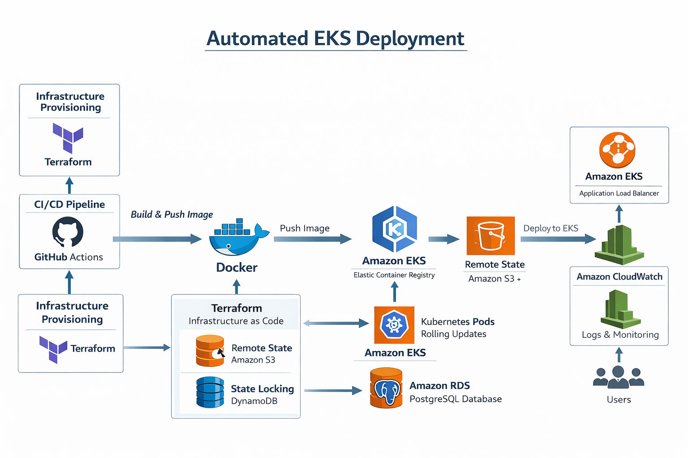

# DevOps Build Lab – Python Log Analyzer on Kubernetes (AWS EKS)

(A fully automated cloud-native deployment of a Python Log Analyzer API running on Kubernetes using AWS EKS, Terraform, Docker, and GitHub Actions.)

This project demonstrates a modern DevOps workflow with Infrastructure as Code, CI/CD automation, containerization, and Kubernetes orchestration.

---

## Architecture Overview

The application is deployed using a fully automated pipeline:

Developer Push → GitHub → CI/CD → Docker → Amazon ECR → Terraform → AWS EKS → Kubernetes Pods → ALB → Users

### Key Components

- **Terraform** – Infrastructure provisioning
- **GitHub Actions** – CI/CD pipeline
- **Docker** – Containerized Python application
- **Amazon ECR** – Container registry
- **Amazon EKS** – Kubernetes cluster
- **Amazon RDS (PostgreSQL)** – Database for storing log results
- **Application Load Balancer (ALB)** – External traffic routing
- **Amazon CloudWatch** – Logging and monitoring
- **S3 Remote State + DynamoDB Locking** – Terraform state management

---

## Architecture Diagram

---

## Application Overview

The **Python Log Analyzer API** processes log files and extracts useful insights such as:

- Error frequency
- Top IP addresses
- Status code distribution
- Suspicious activity patterns

Example endpoint:

POST /analyze

Input:

{
"log": "ERROR: database connection failed"
}

Output:

{
"errors_detected": 1,
"severity": "high"
}

---

## Infrastructure Provisioning (Terraform)

Terraform provisions the following AWS resources:

- VPC and networking
- Amazon EKS cluster
- IAM roles and policies
- Amazon RDS PostgreSQL database
- Application Load Balancer
- Security groups

### Terraform Backend

Remote state management:

- **Amazon S3** – Terraform state storage
- **DynamoDB** – State locking

Example:

